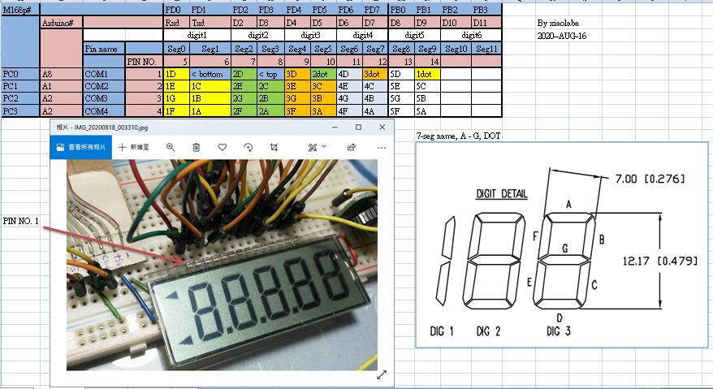
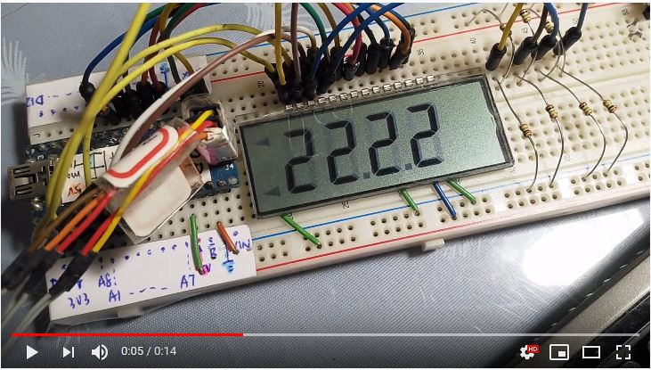
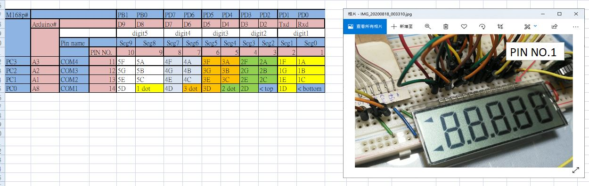
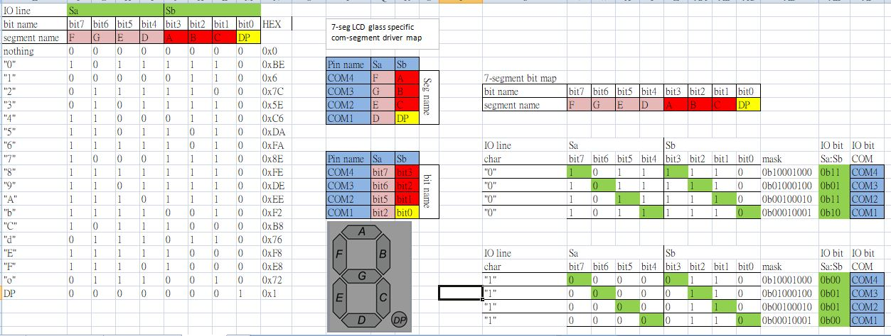

### port the source code from ATmega48 to ATmega168p

### result, looks ok
https://youtu.be/NvokrUh8Wsc  

### wiring diagram
  

### ensure 4 pairs of voltage divider used for COM driver



### port to ATmega168p, AVR-GCC
key points about code & porting, 

incldue those in main.c, register named / ISR vector named has changed  
```
#include "port_to_ATmega168p.h" // port to Atmega168p defines    
```  

change port name in lcd.h, M16 has PORTA, M168p has PORTB but no PORTA, change driver COM_PORT to PORTB and DDRB easy for other CPU  
```  
#define COM_PORT PORTB  // change port name easy for COM driver, tri-state, 0, vdd/2, vdd  
#define COM_DDR  DDRB   // change port name easy for COM driver, bi-state,  0 / vdd  

#define SEG_PORTC PORTC   //  
#define SEG_PORTD PORTD   //  
#define SEG_DDRC  DDRC   //  
#define SEG_DDRD  DDRD   //  
```

### build_atmega168p.bat
compile and build hex, before build, delete all .o .lst .s etc.,  

### burn the chip directly, burn_atmega168p.bat
no need build, uses the hex here provided


### The problem, no easy code reading
lcd.c, almost easy to understand the code and design, but just almost, not really. see this following, and what it does ?

```
    if(Show_Digit & 0x01) frame[0] |= 0x0001 << (i << 1);
    if(Show_Digit & 0x10) frame[0] |= 0x0002 << (i << 1);
		
    if(Show_Digit & 0x02) frame[1] |= 0x0001 << (i << 1);
    if(Show_Digit & 0x20) frame[1] |= 0x0002 << (i << 1);
		
    if(Show_Digit & 0x04) frame[2] |= 0x0001 << (i << 1);
    if(Show_Digit & 0x40) frame[2] |= 0x0002 << (i << 1);
		
    if(Show_Digit & 0x08) frame[3] |= 0x0001 << (i << 1);
    if(Show_Digit & 0x80) frame[3] |= 0x0002 << (i << 1);
```

Trying not to read above code directly, uses this following code to burn the chip and see the result, let's computer to do "this magic part" for us.  
The result, each digit, build I/O signal for segment driver port, but I still do not understand why if(Show_Digit & 0x40) on each bit testing with bit0 & bit4.
```


uint16_t frame[4];

// 數字'0'~'9'
//const uint8_t number[16] = {0xEB, 0x60, 0xC7, 0xE5, 0x6C, 0xAD, 0xAF, 0xE0, 0xEF, 0xED, 0xEE, 0x2F, 0x8B, 0x67, 0x8F, 0x8E};

//my special '7', 7-segment
// 數字'0'~'9', 'A'~'F', dot1, dot2, dot3, top arrow, bottom arrow >
const uint8_t number[21] = {
    0xEB, 0x60, 0xC7, 0xE5, 0x6C, 0xAD, 0xAF, 0xE8, 0xEF, 0xED,    // 0 -9
    0xEE, 0x2F, 0x8B, 0x67, 0x8F, 0x8E,                            // A-F
    0x10, 0x10, 0x10, 0x10, 0x10                                   // dot
};


void setup() {
  Serial.begin(115200);

}

void loop() {
  char str[]="12";
  
  Serial.print("str="); Serial.println(str);
    
  //LCD_Write_Str((unsigned char*) "12345678");
  LCD_Write_Str((unsigned char*)str, sizeof(str) );
  
  Serial.println(frame[0], BIN);
  Serial.println(frame[1], BIN);
  Serial.println(frame[2], BIN);
  Serial.println(frame[3], BIN);
  Serial.println("done");
  while(1); //forever loop here
  
}


/*------------------------------------------------------------------------------
函式名：void LCD_Write_Str(u8 *str)
------------------------------------------------------------------------------*/
void LCD_Write_Str(unsigned char *str, uint8_t NumOfDigits)
{
  uint8_t i, Show_Digit;

  Show_Digit=0;
    
  frame[0] = 0;
  frame[1] = 0;
  frame[2] = 0;
  frame[3] = 0;


  Serial.print("Number Of Digits="); Serial.println(NumOfDigits-1); // NumOfDigits - 1, str is null terminated string with \0, do not count NULL \0 

#define digits 8 // 6 digit LCD
//#define digits 5 // 5 digit LCD

//  for (i=0; i<6; i++)    // 6 digit LCD
//  for (i=0; i<digits; i++)    
  for (i=0; i<2; i++)  // NumOfDigits - 1, str is null terminated string with \0, do not count NULL \0  

  {
    // 查詢碼段儲存在Show_Digit
    if((*(str + i) >= '0') && (*(str + i) <= '9'))      // 數字'0'~'9'
      Show_Digit = number[*(str + i) - '0'];            // index 0-9
    else if((*(str + i) >= 'A') && (*(str + i) <= 'F')) // 字母'A'~'F'
      Show_Digit = number[*(str + i) - 55];             // index 0xA ~ 0xF
    else if((*(str + i) >= 'a') && (*(str + i) <= 'f')) // 字母'a'~'f'
      Show_Digit = number[*(str + i) - 87];             // index 0xA ~ 0xF
    else if ((*(str + i) == '.'))
      Show_Digit = 0x10;


/*
    i=0,     (i << 1)=0,     0x0001 << (i<<1)=000000000001
    i=0,     (i << 1)=0,     0x0002 << (i<<1)=000000000010
    i=1,     (i << 1)=10,    0x0001 << (i<<1)=000000000100
    i=1,     (i << 1)=10,    0x0002 << (i<<1)=000000001000
    i=10,    (i << 1)=100,   0x0001 << (i<<1)=000000010000
    i=10,    (i << 1)=100,   0x0002 << (i<<1)=000000100000
    i=11,    (i << 1)=110,   0x0001 << (i<<1)=000001000000
    i=11,    (i << 1)=110,   0x0002 << (i<<1)=000010000000
    i=100,   (i << 1)=1000,  0x0001 << (i<<1)=000100000000
    i=100,   (i << 1)=1000,  0x0002 << (i<<1)=001000000000
    i=101,   (i << 1)=1010,  0x0001 << (i<<1)=010000000000
    i=101,   (i << 1)=1010,  0x0002 << (i<<1)=100000000000
*/  

    print_i(i);    
    if(Show_Digit & 0x01) frame[0] |= 0x0001 << (i << 1);   
    Serial.print("frame[0]="); Serial.println(frame[0]);
    if(Show_Digit & 0x10) frame[0] |= 0x0002 << (i << 1);
    Serial.print("frame[0]="); Serial.println(frame[0]);   

    print_i(i);          
    if(Show_Digit & 0x02) frame[1] |= 0x0001 << (i << 1);
    Serial.print("frame[1]="); Serial.println(frame[1]);    
    if(Show_Digit & 0x20) frame[1] |= 0x0002 << (i << 1);
    Serial.print("frame[1]="); Serial.println(frame[1]);    

    print_i(i);      
    if(Show_Digit & 0x04) frame[2] |= 0x0001 << (i << 1);
    Serial.print("frame[2]="); Serial.println(frame[2]);
    if(Show_Digit & 0x40) frame[2] |= 0x0002 << (i << 1);
    Serial.print("frame[2]="); Serial.println(frame[2]);

    print_i(i);
    if(Show_Digit & 0x08) frame[3] |= 0x0001 << (i << 1);
    Serial.print("frame[3]="); Serial.println(frame[3]);    
    if(Show_Digit & 0x80) frame[3] |= 0x0002 << (i << 1);
    Serial.print("frame[3]="); Serial.println(frame[3]);
  
  }
}

void print_i(uint8_t i){

    Serial.print("i="); Serial.print(i); 
    Serial.print(",\t (i << 1)="); Serial.print(i<<1);  
    Serial.print(",\t 0x0001 << (i<<1)="); Serial.println(0x0001 << (i << 1), BIN);
     
    Serial.print("i="); Serial.print(i); 
    Serial.print(",\t (i << 1)="); Serial.print(i<<1);  
    Serial.print(",\t 0x0002 << (i<<1)="); Serial.println(0x0002 << (i << 1), BIN);

}
```


### conclusion
this code & porting to ATmega168P is working, as sending string and call to lcd.c, the LCD glass will shows "12345".  
```  
    LCD_Write_Str((unsigned char*) "12345");  
```  
but if we want more easy code and reading, this design was not the one. It works however so far no easy with me, or perhaps my little brain was not so powerful to understood what original author to told. General undersstanding, the Segment driver signal control only, but it is not easy to read.  

Alignement is form left to right, for example, bit order is bit0, bit1...., digit order is dig1, dig2.... etc., port design and order, PD0, PD1......


### let us try further, everything is rigth to left

The habbit, when read a byte in static bit name or form, usually like this,
```
bit7 [1111, 0000] bit0, it is saying 0xF0, easy. MSb is at the left, LSb is at the right
```
and if IO PORT pin# like this, it totally LSb - MSb, something just confusing.  
```
PD0, PD1, PD2, PD3, PD4, PD5, PD6, PD7  
1  , 1  , 1  , 1  , 0  , 0  , 0  , 0  
it is saying F, 0 to to port, but actually is 0x0F when look at bit order for the PORTD

```
so the better arrangement would be like this, maintain the discipline and always code and design with abstraction, ie.
```
PD7, PD6, PD5, PD4, PD3, PD2, P1, PD0  
1  , 1  , 1  , 1  , 0  , 0  , 0  , 0  
now this is east, it is really 0xF0 for the PORTD
```

and try to see the LCD pin# & digit from right to left, it will looks like this,




### re-design, my own LCD mapping and IO drive technique
the overall mapping,


LCD glass, each com-seg combination is a pair of electrodes of a "capacitor", charging or discharging, liquid-crystal twisted and shadowed light, visual the display.
mapping has been fixed, COM1 to COM4, Sa and Sb, from 2D array. As purposely define bit#, the Char table could be build. As long as loading the char, output to COM & SEG driver port, the LCD will shows somehing.

There is example of how to display a single "0" to LCD glass, due to visual persistence of human's eyes,
IO bit	IO bit
Sa:Sb	COM#
0b11	COM4
0b01	COM3
0b11	COM2
0b10	COM1

```
Sa:Sb = 0b11; COM4 = 0; delay a bit;	// charging the "capacitor"
Sa:Sb ^= 0b11; COM4 = 1; delay a bit;	// discharging the "capacitor"

Sa:Sb = 0b01; COM3 = 0; delay a bit;	// charging the "capacitor"
Sa:Sb ^= 0b01; COM3 = 1; delay a bit;	// discharging the "capacitor"

Sa:Sb = 0b11; COM2 = 0; delay a bit;	// charging the "capacitor"
Sa:Sb ^= 0b11; COM2 = 1; delay a bit;	// discharging the "capacitor"

Sa:Sb = 0b10; COM1 = 0; delay a bit;	// charging the "capacitor"
Sa:Sb ^= 0b10; COM1 = 1; delay a bit;	// discharging the "capacitor"

```


