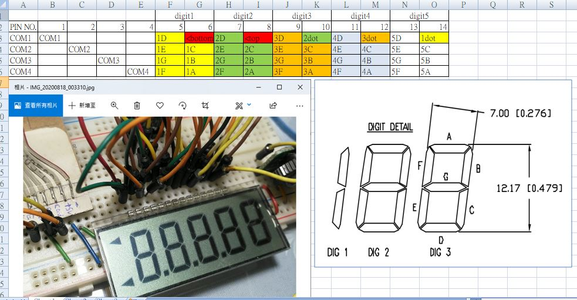

## main.c
original copy, https://www.amobbs.com/forum.php?mod=viewthread&tid=4560171    
downloaded : [LCD_Glass_M16.rar](LCD_Glass_M16.rar)

original code saved in GBK format, uses tool to convets to UTF8 CHT format  
tools : https://github.com/flier268/ConvertZZ  

### before:  
  
  
### after:  
  

## my LCD pin mapping, 5 digits   
  
tools: [LCD_glass_mapper.ino](LCD_glass_mapper.ino)  

