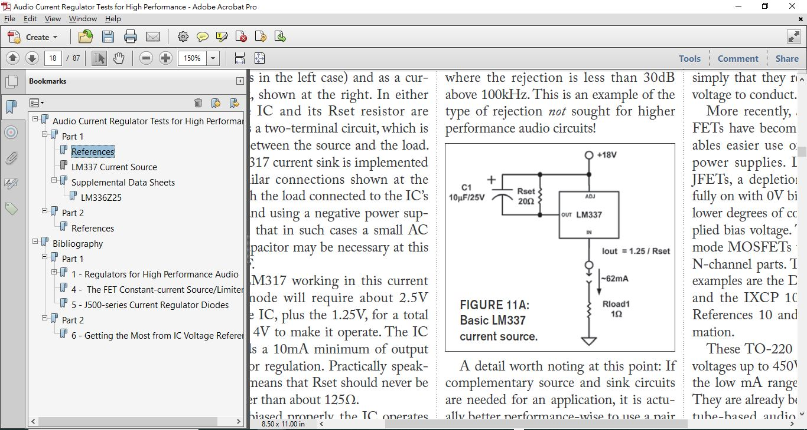
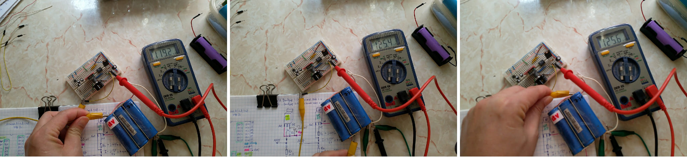

以前實驗過 LM317 做個100mA 的簡單恆流源, 算是成功的  
後來有特殊需要, 想用 LM337 來做同樣的事情, 結果初步實驗, 不如預期, 兩顆電池8.4V, 電流居然變低了, 4V也沒成功, 搞不清楚狀況只有束之高閣, 一直學不會.  

電路圖長這樣, LM317的已經應用實證過沒問題, LM337實驗沒有成功, 所以不敢應用.  
  

    

   

參考來源, 有人說HI-FI都用  
https://www.google.com/search?client=firefox-b-d&q=LM337+Current_Sources_101.pdf  

倚重大神得指點後, 老實按照人家設計的, LM337 加上嗑墊容 Cs, 果然成了  
4V / 8V 輸入都很好, 恆流接近 125mA, 12V 就下滑了120mA, 不明白原因, 可能是 1/4W 的 10 ohm 電阻熱了很多的影響  
電路圖給他更新筆記一番  

實驗的數據  
  
