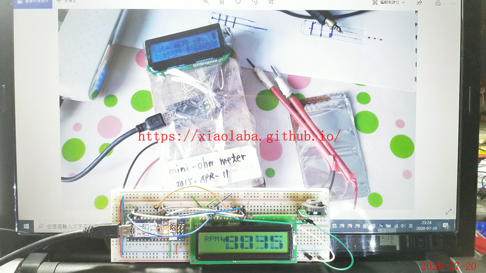

# mini-ohm-metre
AVR MCU + LM317 + HD44780 LCD, ohm metre, range 0.010 ohm - 9.999 ohm, re-build  
  
actually, it should be milliohm meter, but it is fine with named mini-ohm-metre as it is mini.  

  

.  
.  
lost of source code and schematic diagram, reverse engineering has to be with.  
.  
.  

wiring,

.  
.  
.  
.  
Version 2, big digits display and design used, modified LCD backlight, knocked LEDs from blue to white, much better visual and effectiveness.  

.

https://youtu.be/q15g__HHNWE 

### [LM317_LM337_current_source](LM317_LM337_current_source)  
experiment and design  

