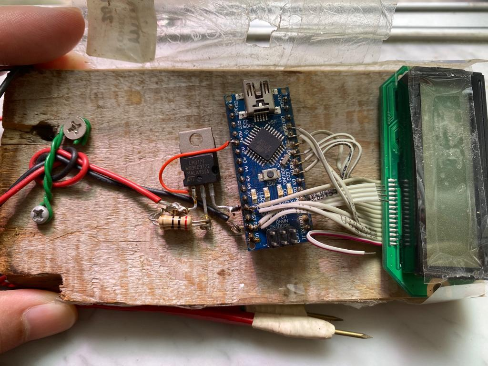

# mini-ohm-metre
AVR MCU + LM317 + HD44780 LCD, ohm metre, range 0.01 ohm - 1.0 ohm, re-build  
  
actually, it should be milliohm meter, but it is fine with named mini-ohm-metre as it is mini.  

  

lost of source code and schemation diagram, reverse engineering has to be with.

wiring,

