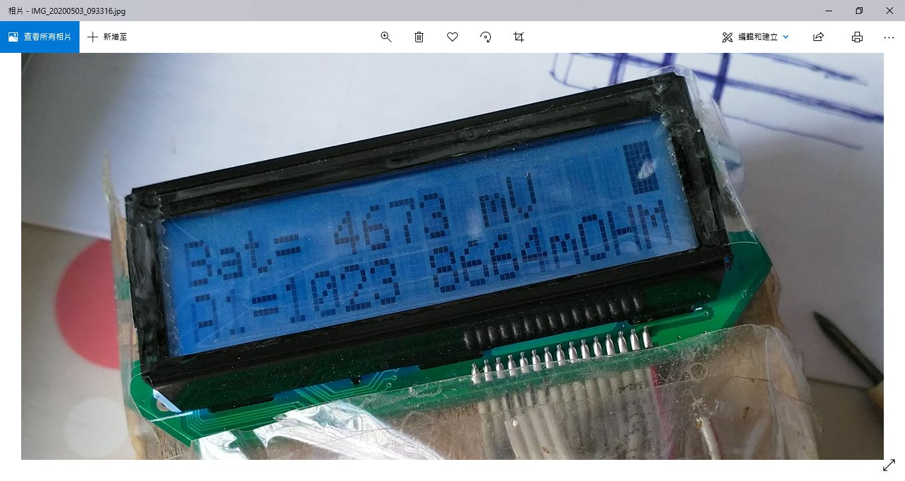
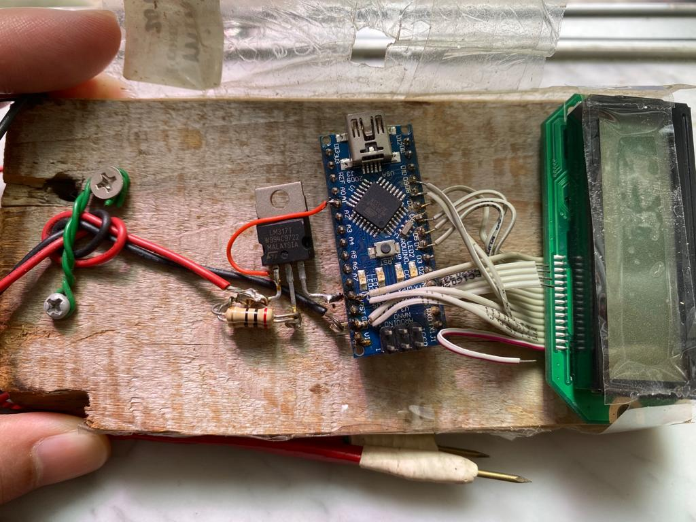

# mini-ohm-metre, 2015-APR-11

lost of source code and schematic diagram, reverse engineering has to be with.

AVR MCU + LM317 + HD44780 LCD, ohm metre, range 0.01 ohm - 9.0 ohm, re-build, 2022-JUL-20    
  
actually, it should be milliohm meter, but it is fine with named mini-ohm-metre as it is mini.  

  
.  
.
.  

wiring,

